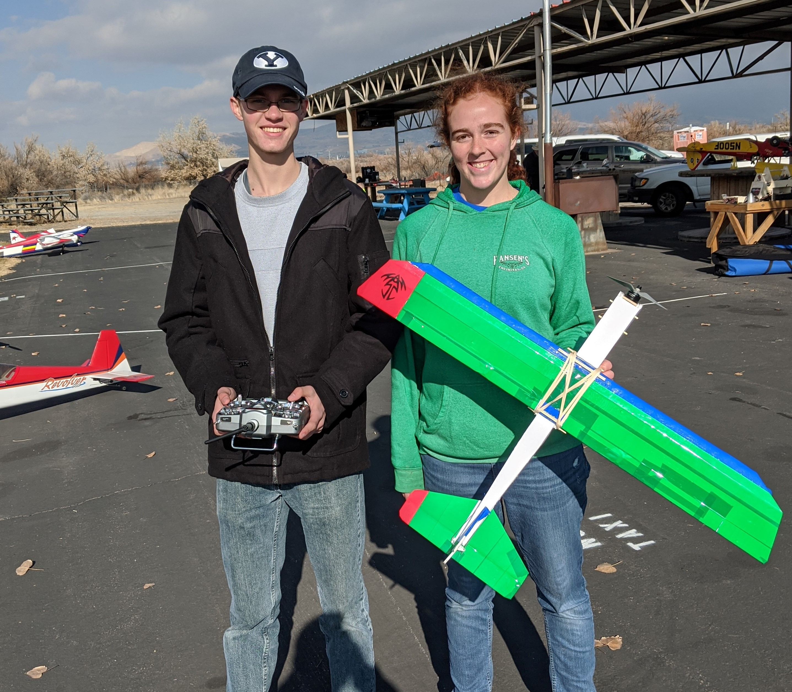

The BYU Aeronautics Club is the only club on campus dedicated to the design, construction, and flight of fixed-wing UAV's. We started in 2018 as a small offshoot from the BYU branch of the AIAA (American Institute of Aeronautics and Astronautics). Dedicated leadership and club members helped to build this club into a community of students commited to engineering excellence. We welcome students from any major or background, giving you the tools and knowledge you need to be successful in the field of aeronautics and have fun along the way.

As you continue to grow through your experiences in the club, you will see large payoffs from your team-based exerience. You will learn to apply principles of design, leadership, teamwork, manufacturing, mission development, performance measurement, and much more. Members of this club have gone on to pursue graduate degrees at high-ranking universities, fill competitive positions in industry, and overall become influential leaders in the field of aerospace. Join us and be part of this unique opportunity to take your career to new heights! What are you waiting for?

### Weekly Meetings: 
Thursdays at 5pm in EB 112

### Contact Us:
Email: byuaeronautics@gmail.com

[Facebook Message](<http://facebook.com/BYUAeronautics>){: .btn .btn--info}

### Sign Up for Weekly Emails:
[Sign Up](<http://eepurl.com/do8S9T>){: .btn .btn--info}

### Club Payments Page:
[Make Payment](<https://commerce.cashnet.com/webcaroc>){: .btn .btn--info}
