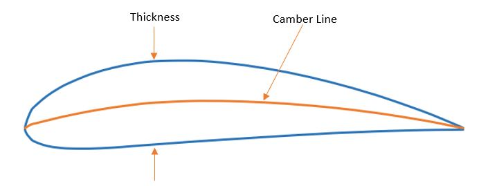
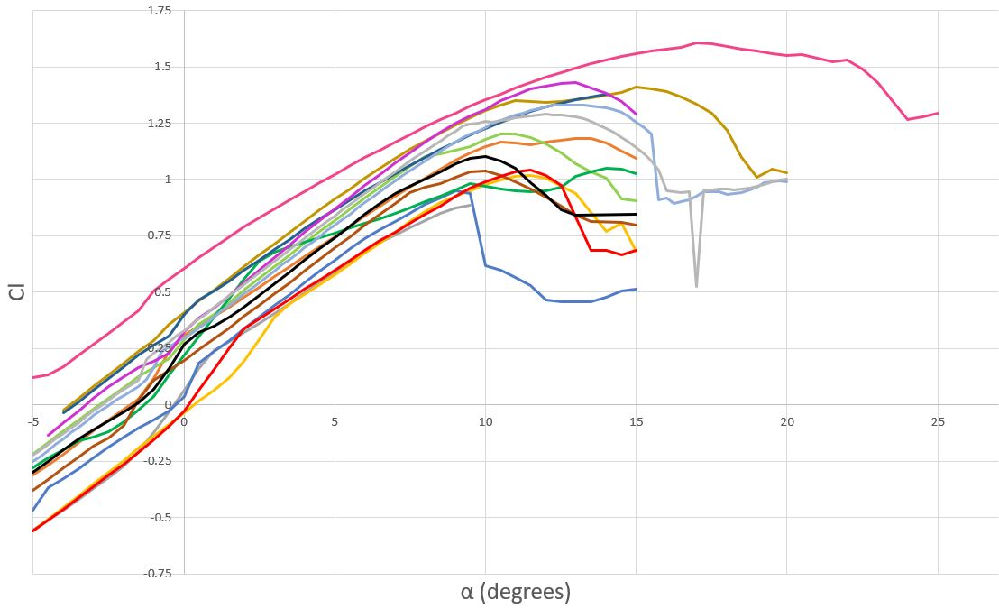

Airfoil selection is one of the earliest and most important decisions made when desiging your UAV. The airfoil will play a large role in determining its aerodynamic performance characteristics and capabilities. As such, care should be taken to choose an airfoil that properly meets the performance requirements for your mission. Relevant requirements may relate to stability, lift and drag characteristics, and manufacturability. These and other important concepts will be discussed.

## Airfoil Geometry
To start, let's discuss the different parts of an airfoil. As you can see below, an airfoil typically has a thin, long profile. This provides large amounts of lift with minimal drag. The front (or forward most part) is called the leading edge, while the back (or aft most part) is called the trailing edge. If you were to draw a straight line from edge to edge, this would be called the chord line and its length is the chord length (or just "chord").

 

### NACA Airfoils
The NACA four-digit series provides a convenient way to demonstrate some additional airfoil parameters. Each digit describes a different parameter of the airfoil. Let's use the NACA 4412 airfoil as an example. The first two digits describe the magnitude and placement of the camber, respectively. In this case, there is a 4% maximum camber at 40% of the chord length from the leading edge. The last two digits give the maximum thickness, which is 12% of the chord length here. Most small UAV's have a thickness-to-chord ratio of about 8-14%.

To explain camber, we refer to the diagram above. The camber line lies exactly (vertically) between the upper and lower surfaces of the airfoil at any point. Camber is the relative distance between the chord line and camber line, measured in chords. Generally, a more cambered airfoil will provide more lift with decreased aerodynamic stability.

## Lift and Drag Performance
One of the most important considerations when selecting an airfoil is the lift and drag characteristics. These and a few other metrics will indicate the airfoil's performance. We will focus first on lift. Keep in mind that with airfoils we are calculating a theoretical coefficient of lift (Cl). The coefficient of lift is a nondimensional parameter that helps us to understand the general lifting capabilities of an airfoil (see equation below). This is different than lift itself, which is simply the force acting on an aircraft perpendicular to the free stream. This is explained in further detail in the section on aerodynamic performance.

{: .align-center}

There are a few key characteristics you are looking for that will be shown on your lift and drag polars. Let's look at the polar that plots the coefficient of lift as a function of angle of attack (α) for various airfoils. The first thing you should notice is the general shape of the polar. There is at first a linear relationship between the Cl and angle of attack. As you increase the angle of the airfoil relative to free flow, the coefficient of lift will increase with a slope of about 2π (Cl/α in radians). At around 10-12 degrees, the airfoil begins to stall, meaning that large amounts of drag are beginning to occur and lift is being lost. This is represented on the polar by a peak and eventual downward curve. 

Some airfoils have a higher peak than others, signifying a higher maximum Cl. This is advantageous because it allows the UAV to take off with smaller lifting surfaces and increases overall aerodynamic efficiency. Here, the airfoil represented by the pink line obviously has the highest Cl max (about 1.6). Another interesting feature is the shape of the peak. A gentler downward curve represents an airfoil with a more forgiving stall development. For example, lift will be lost more gradually on the airfoil represented by the golden line than the red line, which drops sharply and will lose lift very quickly after beginning to stall at Cl max.

Let's take a look at another polar. This one shows the coefficient of drag (Cd) as a function of angle of attack. 

## Other Considerations
Like most design decisions for a UAV, there are tradeoffs in selecting an airfoil.

## The UIUC Airfoil Database

## Formatting Airfoils for XLFR5

