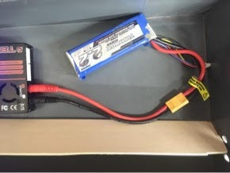
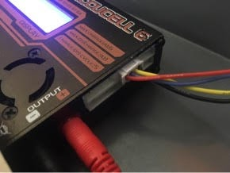
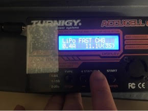
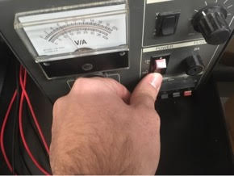

Many modern UAVs use electronic propulsion and control systems, as opposed to the older gas-propelled systems. Such a system requires power, namely in the form of a battery. The preferred battery type in the Aeronautics Club is the Lithium Polymer battery. This is due to its ease of care and high energy density. That being said, the main focus of this page will be on LiPo batteries, but care and use of other batteries will be covered.

## Battery Types
Although we primarily use LiPo batteries, there a few different battery types in popular use in the model aviation world. These include Lithium Polymer (LiPo), Lithiu Iron (LiFe), Nickel Metal Hydride (NiMH), and Lithium-ion (LI). There are various tradeoffs associated with selecting one battery over another including ease of use, energy density, capabilities, and lifespan. Cost and availability should also be considered. We will conduct a brief overview of each and their various characteristics.

### Lithium Polymer Batteries
LiPo batteries are by far the most widely used and available batteries in model aviation.  

### Nickel Metal Hydride Batteries

### Lithium Iron Batteries

### Lithium-Ion Batteries

### Comparison Table
| Characteristic | LiPo | NiMH | LiFe | LI |
|-------|--------|---------|---------|
| Energy Density (Wh/kg) | 100-265 | 60-120 | 90-160 | 100-265 |
| Cycle Durability (#cycles) | 200-400 | 180-2000 | 2000 | 400-2000 |
| Average Price (Wh/dollar) | 3-4 | $$$ | 3-24 | 3-4 |

## Charging LiPo Batteries
This section will step you through using the Turnigy chargers in the lab to charge LiPo batteries. Although you may be using a different type of battery, the general controls of the instrument will be the same.

### Step 1 - Power on DC Power Supply

### Step 2 - Plug in Battery
For LiPo batteries, there are two leads that need to be connected to the charger so that the individual cells of the battery can maintain their balance. This particular battery is 3-cell (3S) and uses an XT-60 connector (pictured left) to plug into the charging port. Other connections will require different adapters. Plug the balance connector into the port with the same number of pins (pictured right).

 

### Step 3 - Initiate LiPo Program
When the charger turns on, the screen will most likely look like the picture below. If this is not the case, press the TYPE/STOP button a few times to back up to the PROGRAM SELECT menu (pictured right)

 

#### Step 3a - Enter Charging Menu
Once you get the LiPo BATT selection, press START/ENTER to enter the next level of menus. The screen will appear as below. You can cycle through different functions (charging, discharging, etc.) by pressing the STATUS buttons. We will be charging for this demonstration. When you get to CHARGE, press START.

#### Step 3b - Adjusting Voltage and Ampage
Once in the CHARGE program, press START again to change the parameters for charging. You will typically set the current to the Ah rating of your battery, e.g. a 2200mAh battery should be set to 2.2A for charging. Press the STATUS arrow buttons to adjust the value. Press START again to move from current to voltage. For LiPo charging, there are fixed voltage values based on the number of cells (3.7V per cell). If there is not a clear indication of the number of cells, it is one less than the number of leads on your balance connecter. Press the STATUS arrow buttons to adjust this value, then press START one more time.

#### Step 3c - Begin Charging
Once you have set the charging parameters, hold the START button until it checks battery status and the screen below and left appears. Check to make sure the numbers for R: and S: are the same then press START again and the screen below right will appear. The battery has now begun charging. You may press the STATUS arrow buttons to view the cell voltages, ending voltage, and several other things.

 

#### Step 3d - Finish Charging
The charger will stop charging automatically once it reaches the end voltage, but you may stop the charging process at any time by pressing STOP. It indicates the completion of the charging process with an on-screen message and a distinct jingling sound that will ring until you go to the charger and press STOP. You may now disconnect your charged battery for use!

### Step 4 - Turn off DC Power Supply

Do the right thing. Remember to turn it off.

